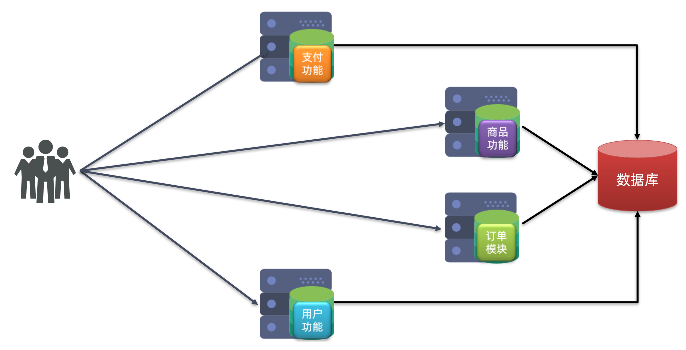
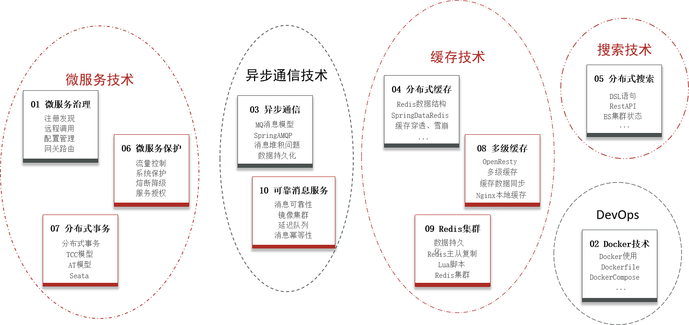

随着互联网行业的发展，对服务的要求也越来越高，服务架构也从单体架构逐渐演变为现在流行的微服务架构。这些架构之间有怎样的差别呢？

# 1. 微服务架构
## 1.1 单体架构
**单体架构**：将业务的所有功能集中在一个项目中开发，打成一个包部署。

**优点：**
- 架构简单
- 部署成本低

**缺点：**
- 耦合度高（维护困难、升级困难）

## 1.2.分布式架构
**分布式架构**：根据业务功能对系统做拆分，每个业务功能模块作为独立项目开发，称为一个服务。

**优点：**
- 降低服务耦合
- 有利于服务升级和拓展

**缺点：**
- 服务调用关系错综复杂

分布式架构虽然降低了服务耦合，但是服务拆分时也有很多问题需要思考：
- 服务拆分的粒度如何界定？
- 服务之间如何调用？
- 服务的调用关系如何管理？

人们需要制定一套行之有效的标准来约束分布式架构。

## 1.3.微服务

微服务的架构特征：

- **单一职责**: 微服务拆分粒度更小，每一个服务都对应唯一的业务能力，做到单一职责
- **高度自治**: 团队独立、技术独立、数据独立，独立部署和交付
- **面向服务**: 服务提供统一标准的接口，与语言和技术无关
- **隔离性强**: 服务调用做好隔离、容错、降级，避免出现级联问题(也即避免由于被调用微服务的崩溃导致调用者的崩溃, 防止链式反应)

微服务的上述特性其实是在给分布式架构制定一个标准，进一步降低服务之间的耦合度，提供服务的独立性和灵活性。做到高内聚，低耦合。

因此，可以认为**微服务**是一种经过良好架构设计的 **分布式架构方案**。

# 微服务技术栈
## 第一层微服务技术架构

如上图为第一层微服务技术架构, 可以分块分步的来解读这张图:
1. **服务集群**, 它是指一个项目中的成百上千个微服务组成的集群, 它们之间可能存在复杂的调用关系.
2. **注册中心**, 每个微服务都需要在注册中心注册自己的ip、端口、功能等信息, 方便统一进行维护管理。
3. **配置中心**, 每个微服务都有各自的配置项信息, 它们交由配置中心统一管理. 这样, 每当有一个新的微服务加入集群时, 它首先会将自己的信息注册到注册中心, 在需要调用其它微服务时, 会先从注册中心拉取对应地址信息, 随后再从配置中心拉取配置信息, 这样就可以很方便的使用服务.
4. **服务网关**, 用户访问的接口, 访问权限控制以及完成请求路由和负载均衡等等功能.
5. **分布式缓存**, 为了处理用户的高并发访问, 需要用到缓存技术, 并且是分布式缓存, 可以完成简单的查询操作.
6. **分布式搜索**, 对于复杂的查询, 还需要用到检索技术. 此时, 数据库(也是分布式的)主要负责完成写相关操作以及事务相关操作等.
7. **消息队列**, 完成一次请求往往会需要多个微服务的参与, 它们之间就形成了一个服务链, 通常来讲一次响应时间也就是它们各自完成的时间之和. 而这里, 由于微服务的自治与面向服务的特点, 可以有一个异步消息队列, 一个微服务可以去通知而非调用另一个微服务, 使得各个微服务可以部分的并行.  

## 更进一步的微服务技术架构

如图所示, 进一步的架构先是添加了:
1. **系统监控/链路追踪**: 这些服务器监控微服务集群各个微服务的健康状态, 可以快速定位服务故障.
2. **分布式服务日志**: 记录系统运行日志.
接着右侧对应的是自动化部署的技术, 应用该技术做到持续化集成(DevOps), 也即开发一部分就集成一部分(方便测试), 而不是开发结束后再统一, DevOps 符合敏捷开发的原则.

# 微服务技术选型与分类

# 总结
微服务技术是为了应对大型项目开发而产生的一种经过良好设计的分布式架构方案, 它把项目的业务逻辑进行细粒度的划分, 使得每一个微服务负责处理单一的业务逻辑. 微服务满足职责单一、高度自治、面向服务和隔离性强的特点. 另外, 为了管理众多的微服务, 还需要使用到注册中心和配置中心, 为了管理用户访问, 需要使用到服务网关, 为了高效的访问数据库, 需要使用到分布式缓存和分布式搜索, 为了使得服务链路并发执行, 需要使用异步消息队列. 在开发中, 为了调试的方便, 需要用到系统监控链路追踪和分布式日志, 为了支持持续化集成, 需要用到例如 docker 等的技术. 随后, 本小节又对为实现这些理论进行了技术选型与分类并规划了学习路线, 然而, 这些技术如何落地? 下一小节将给出说明.

