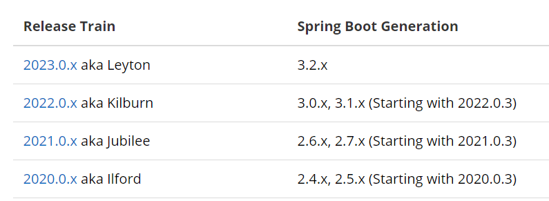

#### 上节回顾:
1. 单体架构：简单方便，高度耦合，扩展性差，适合小型项目。例如：学生管理系统
2. 分布式架构：松耦合，扩展性好，但架构复杂，难度大。适合大型互联网项目，例如：京东、淘宝
3. 微服务：一种良好的分布式架构方案
   * 优点：拆分粒度更小、服务更独立、耦合度更低
   * 缺点：架构非常复杂，运维、监控、部署难度提高
SpringCloud是微服务架构的一站式解决方案，集成了各种优秀微服务功能组件


本小节将在一个小示例项目中, 使用 SpringCloud 提供的框架实现远程调用.

## 1. 服务拆分原则
* 不同微服务，不要重复开发相同业务
* 微服务数据独立，不要访问其它微服务的数据库
* 微服务可以将自己的业务暴露为接口，供其它微服务调用

## 2. Cloud-Demo 项目准备
### 项目结构
该项目有两个微服务 orders 和 user, orders 中有一个依据 id 查询订单信息的业务方法, 它除了返回订单基本信息外还要求返回对应的用户信息.
user 中包含一个依据用户id 查询用户信息的业务方法.
```git
cloud-demo: 父工程, 管理依赖
orders-service: 订单微服务, 负责订单相关业务
user-service: 用户微服务, 负责用户相关业务
```
要求：
订单微服务和用户微服务都必须有各自的数据库，相互独立
订单服务和用户服务都对外暴露Restful的接口
订单服务如果需要查询用户信息，只能调用用户服务的Restful接口，不能查询用户数据库

### 数据库
依据微服务拆分原则, 两个微服务需要两个数据库: `mst_order`, `mst_user`

`mst_order` 包含一个 orders 表, 表结构及示例数据如下:
```sql
-- ----------------------------
-- Table structure for orders
-- ----------------------------
DROP TABLE IF EXISTS `orders`;
CREATE TABLE `orders`  (
  `id` bigint(20) NOT NULL AUTO_INCREMENT COMMENT '订单id',
  `user_id` bigint(20) NOT NULL COMMENT '用户id',
  `name` varchar(100) CHARACTER SET utf8 COLLATE utf8_general_ci NULL DEFAULT NULL COMMENT '商品名称',
  `price` bigint(20) NOT NULL COMMENT '商品价格',
  `num` int(10) NULL DEFAULT 0 COMMENT '商品数量',
  PRIMARY KEY (`id`) USING BTREE,
  UNIQUE INDEX `username`(`name`) USING BTREE
) ENGINE = InnoDB AUTO_INCREMENT = 109 CHARACTER SET = utf8 COLLATE = utf8_general_ci ROW_FORMAT = Compact;

-- ----------------------------
-- Records of orders
-- ----------------------------
INSERT INTO `orders` VALUES (101, 1, 'Apple 苹果 iPhone 12 ', 699900, 1);
INSERT INTO `orders` VALUES (102, 2, '雅迪 yadea 新国标电动车', 209900, 1);
INSERT INTO `orders` VALUES (103, 3, '骆驼（CAMEL）休闲运动鞋女', 43900, 1);
INSERT INTO `orders` VALUES (104, 4, '小米10 双模5G 骁龙865', 359900, 1);
INSERT INTO `orders` VALUES (105, 5, 'OPPO Reno3 Pro 双模5G 视频双防抖', 299900, 1);
INSERT INTO `orders` VALUES (106, 6, '美的（Midea) 新能效 冷静星II ', 544900, 1);
INSERT INTO `orders` VALUES (107, 2, '西昊/SIHOO 人体工学电脑椅子', 79900, 1);
INSERT INTO `orders` VALUES (108, 3, '梵班（FAMDBANN）休闲男鞋', 31900, 1);
```

`mst_user` 包含一个用户表:
```sql
-- ----------------------------
-- Table structure for user
-- ----------------------------
DROP TABLE IF EXISTS `user`;
CREATE TABLE `user`  (
  `id` bigint(20) NOT NULL AUTO_INCREMENT,
  `username` varchar(100) CHARACTER SET utf8 COLLATE utf8_general_ci NULL DEFAULT NULL COMMENT '收件人',
  `address` varchar(255) CHARACTER SET utf8 COLLATE utf8_general_ci NULL DEFAULT NULL COMMENT '地址',
  PRIMARY KEY (`id`) USING BTREE,
  UNIQUE INDEX `username`(`username`) USING BTREE
) ENGINE = InnoDB AUTO_INCREMENT = 109 CHARACTER SET = utf8 COLLATE = utf8_general_ci ROW_FORMAT = Compact;

-- ----------------------------
-- Records of user
-- ----------------------------
INSERT INTO `user` VALUES (1, '柳岩', '湖南省衡阳市');
INSERT INTO `user` VALUES (2, '文二狗', '陕西省西安市');
INSERT INTO `user` VALUES (3, '华沉鱼', '湖北省十堰市');
INSERT INTO `user` VALUES (4, '张必沉', '天津市');
INSERT INTO `user` VALUES (5, '郑爽爽', '辽宁省沈阳市大东区');
INSERT INTO `user` VALUES (6, '范兵兵', '山东省青岛市');
```
### 项目依赖引入与初始业务开发
SpringCloud 与 SpringBoot 的版本兼容关系:

https://spring.io/projects/spring-cloud

#### cloud-demo
父工程 SpringBoot 依赖版本为 `3.1.0`, 那么 SpringCloud 的版本号是 `2022.0.0`.
注意这里没有使用最新版本, 例如 `3.2.2` & `2023.0.0`, 这是由于 `mybatis-plus` 可能存在版本兼容问题:
```git
Invalid value type for attribute 'factoryBeanObjectType': java.lang.String
```
详情可见:
https://developer.aliyun.com/article/1395691
https://github.com/mybatis/spring/issues/855?spm=a2c6h.12873639.article-detail.8.3bdc62729AVxws

父工程 pom 文件内容如下:
```xml
<parent>
    <groupId>org.springframework.boot</groupId>
    <artifactId>spring-boot-starter-parent</artifactId>
    <version>3.1.0</version>
    <relativePath/> <!-- lookup parent from repository -->
</parent>

<groupId>com.cloud</groupId>
<artifactId>micserv</artifactId>
<version>1.0</version>
<packaging>pom</packaging>

<modules>
    <module>order-service</module>
    <module>user-service</module>
</modules>

<properties>
    <java.version>17</java.version>
    <spring-cloud.version>2022.0.0</spring-cloud.version>
    <mysql.version>8.1.0</mysql.version>
    <mybatis-plus.version>3.5.5</mybatis-plus.version>
</properties>

<dependencyManagement>
    <dependencies>
        <!-- springCloud -->
        <dependency>
            <groupId>org.springframework.cloud</groupId>
            <artifactId>spring-cloud-dependencies</artifactId>
            <version>${spring-cloud.version}</version>
            <type>pom</type>
            <scope>import</scope>
        </dependency>
        <!-- mysql驱动 -->
        <dependency>
            <groupId>com.mysql</groupId>
            <artifactId>mysql-connector-j</artifactId>
            <version>${mysql.version}</version>
        </dependency>
        <!--mybatis plus-->
        <dependency>
            <groupId>com.baomidou</groupId>
            <artifactId>mybatis-plus-boot-starter</artifactId>
            <version>${mybatis-plus.version}</version>
        </dependency>
    </dependencies>
</dependencyManagement>

<dependencies>
    <dependency>
        <groupId>org.projectlombok</groupId>
        <artifactId>lombok</artifactId>
    </dependency>
</dependencies>
```

注意 mysql 表格名称要和 java 实体一致, 除此之外, 表名不可以是关键字, 例如 `order`.

#### order-service
先引入 mysql, mybatis-plus, spring-web 依赖:
```xml
<dependencies>
    <!-- Spring Web-->
    <dependency>
        <groupId>org.springframework.boot</groupId>
        <artifactId>spring-boot-starter-web</artifactId>
    </dependency>
    <!-- Mysql -->
    <dependency>
        <groupId>com.mysql</groupId>
        <artifactId>mysql-connector-j</artifactId>
    </dependency>
    <!-- Mybatis-plus-->
    <dependency>
        <groupId>com.baomidou</groupId>
        <artifactId>mybatis-plus-boot-starter</artifactId>
    </dependency>
</dependencies>
```
接着创建需要的实体, orders 实体:
```java
@Data
@NoArgsConstructor
@AllArgsConstructor
public class Orders {
    private Long id;
    private Long userId;
    private String name;
    private Double price;
    private Integer num;
}
```
user 实体:
```java
@Data
@NoArgsConstructor
@AllArgsConstructor
public class User {
    private Long id;
    private String username;
    private String address;
}
```
返回结果包装类:
```java
@Data
@NoArgsConstructor
@AllArgsConstructor
public class Result<T> {
    private Integer code;
    private String msg;
    private T data;

    public static <T> Result<T> success(T obj){
        return new Result<T>(1, "success", obj);
    }
}
```
为了返回值包含 User 详细信息, 设计 OrdersDto 类:
```java
@Data
@NoArgsConstructor
@AllArgsConstructor
public class OrdersDto extends Orders {
    private User user;
}
```

在实体类设计完毕后, 再把 mapper/service/controller 建好, controller 方法如下:

```java
@RestController
@Slf4j
@RequestMapping("/order")
public class OrderController {
    @Autowired
    private OrderService orderService;

    @GetMapping("/{orderId}")
    public Result<OrdersDto> getById(@PathVariable Long orderId){
        log.info("get order details by {}", orderId);
        OrdersDto dto = orderService.getByIdWithUser(orderId);
        return Result.success(dto);
    }
}
```

service 层重写方法, 利用 BeanUtils 工具复制实体属性:
```java
@Override
public OrdersDto getByIdWithUser(Long orderId) {
    Orders orders = getById(orderId);
    OrdersDto dto = new OrdersDto();
    BeanUtils.copyProperties(orders, dto);
    return dto;
}
```
注意配置文件配置好 mysql 的连接要素, 以及端口号(不同的微服务在不同的端口号)
运行该模块, 访问地址: http://localhost:8081/order/101
```json
{
    "code": 1,
    "msg": "success",
    "data": {
        "id": 101,
        "userId": 1,
        "name": "Apple 苹果 iPhone 12 ",
        "price": 699900,
        "num": 1,
        "user": null
    }
}
```
可见此时可以访问到基本的数据, 但 user 仍为 null.

#### user-service
user-service 模块的 pom 文件类似于 order, 同时建立好 User 实体, mapper 层, service 层, 编写 controller 层:
```java
@RestController
@Slf4j
@RequestMapping("/user")
public class UserController {
    @Autowired
    private UserService userService;

    @GetMapping("/{userId}")
    public Result<User> getById(@PathVariable Long userId){
        log.info("get user details by {}", userId);
        return Result.success(userService.getById(userId));
    }

}
```
它包含一个依据id查询 user 的方法.

## 服务远程调用
为了使得 order-service 模块可以得到 user-service 中的数据信息, 我们不能直接去访问 user-service 的数据库, 而是通过 java 实现 http 远程请求调用获取实体类.

在 order-service 的启动程序中加入 RestTemplate 的 bean 方法:
```java
@SpringBootApplication
public class OrderServiceApplication {

    public static void main(String[] args) {
        SpringApplication.run(OrderServiceApplication.class, args);
    }

    @Bean
    public RestTemplate restTemplate(){
        return new RestTemplate();
    }
}
```
修改 order-service 的 service 层的 getByIdWithUser() 方法, 使它可以执行远程调用:
```java
@Override
public OrdersDto getByIdWithUser(Long orderId) {
    Orders orders = getById(orderId);
    OrdersDto dto = new OrdersDto();
    BeanUtils.copyProperties(orders, dto);
    // 构造 url 以进行远程调用
    String url = "http://localhost:8082/user/"+dto.getUserId();
    Result result = restTemplate.getForObject(url, Result.class);
//        System.out.println(result.getData().getClass().getSimpleName());
    User user = new ObjectMapper().convertValue(result.getData(), User.class);
    dto.setUser(user);
    return dto;
}
```
这里有两个点需要注意:
一是请求返回得到的是 Result 类型而不是直接的 User 类型,
其次, 由于这里使用了序列化, user 被序列化为 LinkedHashMap(字典类型)
因此需要将他转换为对象实体, 这里无法进行强制转换, 可以采取 `new ObjectMapper().convertValue`方法.
参考: https://cloud.tencent.com/developer/article/2194290
https://www.cnblogs.com/zys2019/p/14100058.html

此时将两个模块都运行起来, 访问地址 http://localhost:8081/order/102
```json
{
    "code": 1,
    "msg": "success",
    "data": {
        "id": 102,
        "userId": 2,
        "name": "雅迪 yadea 新国标电动车",
        "price": 209900,
        "num": 1,
        "user": {
            "id": 2,
            "username": "文二狗",
            "address": "陕西省西安市"
        }
    }
}
```


